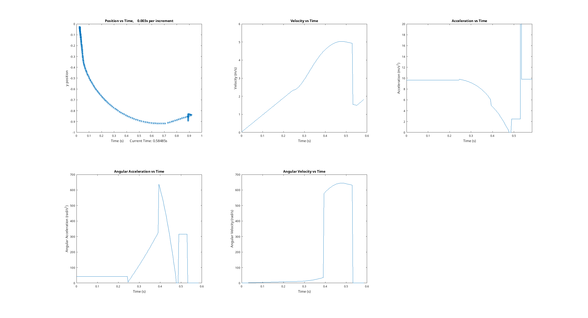

# Ball Track Optimization

Matlab program to test time to reach end of ball track. Includes graphs of angular acceleration, angular velocity, velocity, acceleration, and a snapshot of the ball after a user define period.

 

[Video of what we're trying to simulate](https://www.youtube.com/watch?v=0w8jsNglxQI&feature=youtu.be) 

### Usage
1. Open `main.m`
2. Edit the constants under the `% Edit these constants` comment at the top of main

**Optional**

You may change the path you want to test. Simply rearrange the functions `slope`, `brachistochrone`, `bounce`, and `free` functions in `main.m`.  

### Group Members:

Anjandev Momi

David Cao

Brindan Ramalingam

Ricardo Bravo

### License
AGPL-3.0-or-later
